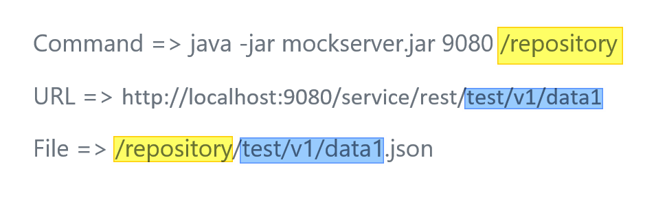

# mock-http-server
A minimal java mock server for soap/rest test
## Getting Started
### Build
```
mvn clean package 
 produce : target\mockserver-1.0.0-jar-with-dependencies.jar
```
### Usage
```
java -jar mockserver-1.0.0-jar-with-dependencies.jar <port> <path_resources>
```  
* port : listening port's server
* path_resources = path of replies
### Example
#### SOAP
##### Prepare
> Request.xml ( testResources )
```xml
<soapenv:Envelope xmlns:soapenv="http://schemas.xmlsoap.org/soap/envelope/" 
                  xmlns:ns="http://my.request.namespace/">
 <soapenv:Body>
  <ns:testResources />
 </soapenv:Body>
</soapenv:Envelope>
```
> <path_resources>/testResources.xml
```xml
<ns:testResourcesResponse xmlns:ns="http://my.response.namespace/">
 <return>true</return>
</ns:testResourcesResponse>
```
##### Execute
> java -jar mockserver-1.0.0-jar-with-dependencies.jar 9080 <path_resources>

> curl --data "@Request.xml" http://localhost:9080/service/soap
```xml
<soap:Envelope xmlns:soap="http://schemas.xmlsoap.org/soap/envelope/">
 <soap:Body>
  <ns:testResourcesResponse xmlns:ns="http://my.response.namespace/">
   <return>true</return>
  </ns:testResourcesResponse>
 </soap:Body>
</soap:Envelope>
```
#### REST
##### PATHS

```bash
Command => java -jar mockserver-1.0.0-jar-with-dependencies.jar 9080 <span style="color:yellow">/repository</span>
URL =>
File => <span style="color:yellow">/repository</span><span style="color:blue">/test/v1/data</span>.json

```

##### Prepare
> <path_resources>/testResources.json
```json
{
  "testResourcesResponse": {
    "return": "true"
  }
}
```
##### Execute
> java -jar mockserver-1.0.0-jar-with-dependencies.jar
9080 <path_resources>

> curl http://localhost:9080/service/rest/testResources
```json
{
  "testResourcesResponse": {
    "return": "true"
  }
}
```
